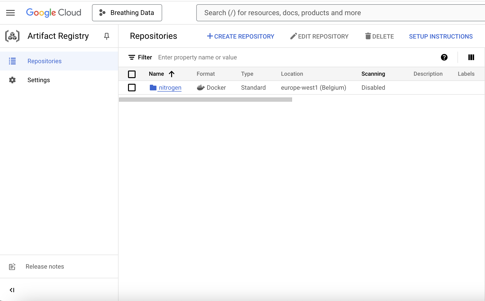

# Exam template for 02476 Machine Learning Operations

This is the report template for the exam. Please only remove the text formatted as with three dashes in front and behind
like:

```--- question 1 fill here ---```

Where you instead should add your answers. Any other changes may have unwanted consequences when your report is
auto-generated at the end of the course. For questions where you are asked to include images, start by adding the image
to the `figures` subfolder (please only use `.png`, `.jpg` or `.jpeg`) and then add the following code in your answer:

```markdown

```

In addition to this markdown file, we also provide the `report.py` script that provides two utility functions:

Running:

```bash
python report.py html
```

Will generate a `.html` page of your report. After the deadline for answering this template, we will auto-scrape
everything in this `reports` folder and then use this utility to generate a `.html` page that will be your serve
as your final hand-in.

Running

```bash
python report.py check
```

Will check your answers in this template against the constraints listed for each question e.g. is your answer too
short, too long, or have you included an image when asked. For both functions to work you mustn't rename anything.
The script has two dependencies that can be installed with

```bash
pip install typer markdown
```

## Overall project checklist

The checklist is *exhaustive* which means that it includes everything that you could do on the project included in the
curriculum in this course. Therefore, we do not expect at all that you have checked all boxes at the end of the project.
The parenthesis at the end indicates what module the bullet point is related to. Please be honest in your answers, we
will check the repositories and the code to verify your answers.

### Week 1

* [✅] Create a git repository (M5)
* [✅] Make sure that all team members have write access to the GitHub repository (M5)
* [✅] Create a dedicated environment for you project to keep track of your packages (M2)
* [✅] Create the initial file structure using cookiecutter with an appropriate template (M6)
* [✅] Fill out the `data.py` file such that it downloads whatever data you need and preprocesses it (if necessary) (M6)
* [✅] Add a model to `model.py` and a training procedure to `train.py` and get that running (M6)
* [✅] Remember to fill out the `requirements.txt` and `requirements_dev.txt` file with whatever dependencies that you
    are using (M2+M6)
* [✅] Remember to comply with good coding practices (`pep8`) while doing the project (M7)
* [✅] Do a bit of code typing and remember to document essential parts of your code (M7)
* [✅] Setup version control for your data or part of your data (M8)
* [✅] Add command line interfaces and project commands to your code where it makes sense (M9)
* [✅] Construct one or multiple docker files for your code (M10)
* [✅] Build the docker files locally and make sure they work as intended (M10)
* [✅] Write one or multiple configurations files for your experiments (M11)
* [✅] Used Hydra to load the configurations and manage your hyperparameters (M11)
* [✅] Use profiling to optimize your code (M12)
* [✅] Use logging to log important events in your code (M14)
* [✅] Use Weights & Biases to log training progress and other important metrics/artifacts in your code (M14)
* [✅] Consider running a hyperparameter optimization sweep (M14)
* [ ] Use PyTorch-lightning (if applicable) to reduce the amount of boilerplate in your code (M15)

### Week 2

* [✅] Write unit tests related to the data part of your code (M16)
* [✅] Write unit tests related to model construction and or model training (M16)
* [✅] Calculate the code coverage (M16)
* [✅] Get some continuous integration running on the GitHub repository (M17)
* [✅] Add caching and multi-os/python/pytorch testing to your continuous integration (M17)
* [✅] Add a linting step to your continuous integration (M17)
* [✅] Add pre-commit hooks to your version control setup (M18)
* [✅] Add a continues workflow that triggers when data changes (M19)
* [ ] Add a continues workflow that triggers when changes to the model registry is made (M19)
* [✅] Create a data storage in GCP Bucket for your data and link this with your data version control setup (M21)
* [✅] Create a trigger workflow for automatically building your docker images (M21)
* [✅] Get your model training in GCP using either the Engine or Vertex AI (M21)
* [✅] Create a FastAPI application that can do inference using your model (M22)
* [✅] Deploy your model in GCP using either Functions or Run as the backend (M23)
* [✅] Write API tests for your application and setup continues integration for these (M24)
* [✅] Load test your application (M24)
* [✅] Create a more specialized ML-deployment API using either ONNX or BentoML, or both (M25)
* [✅] Create a frontend for your API (M26)

### Week 3

* [ ] Check how robust your model is towards data drifting (M27)
* [ ] Deploy to the cloud a drift detection API (M27)
* [✅] Instrument your API with a couple of system metrics (M28)
* [ ] Setup cloud monitoring of your instrumented application (M28)
* [ ] Create one or more alert systems in GCP to alert you if your app is not behaving correctly (M28)
* [✅] If applicable, optimize the performance of your data loading using distributed data loading (M29)
* [ ] If applicable, optimize the performance of your training pipeline by using distributed training (M30)
* [✅] Play around with quantization, compilation and pruning for you trained models to increase inference speed (M31)

### Extra

* [✅] Write some documentation for your application (M32)
* [✅] Publish the documentation to GitHub Pages (M32)
* [✅] Revisit your initial project description. Did the project turn out as you wanted?
* [✅] Create an architectural diagram over your MLOps pipeline
* [✅] Make sure all group members have an understanding about all parts of the project
* [✅] Uploaded all your code to GitHub

## Group information

### Question 1
> **Enter the group number you signed up on <learn.inside.dtu.dk>**
>
> Answer:

96

### Question 2
> **Enter the study number for each member in the group**
>
> Example:
>
> *sXXXXXX, sXXXXXX, sXXXXXX*
>
> Answer:

s242798, s242796, s242816, s223481, s246733

### Question 3
> **A requirement to the project is that you include a third-party package not covered in the course. What framework**
> **did you choose to work with and did it help you complete the project?**
>
> Recommended answer length: 100-200 words.
>
> Example:
> *We used the third-party framework ... in our project. We used functionality ... and functionality ... from the*
> *package to do ... and ... in our project*.
>
> Answer:

We chose to utilize the PyTorch Image Models (timm) as our third-party framework. It allows us to load pre-trained models that we can use in our project. For our image classification task, we chose to use [timm/efficientnet_b1.ra4_e3600_r240_in1k - Hugging Face](https://huggingface.co/timm/efficientnet_b1.ra4_e3600_r240_in1k). Using a pre-trained model benefits us greatly, as we both save time that would be normaly required to train the model, and we also start with an architecture, that is already tried and tested.

## Coding environment

> In the following section we are interested in learning more about you local development environment. This includes
> how you managed dependencies, the structure of your code and how you managed code quality.

### Question 4

> **Explain how you managed dependencies in your project? Explain the process a new team member would have to go**
> **through to get an exact copy of your environment.**
>
> Recommended answer length: 100-200 words
>
> Example:
> *We used ... for managing our dependencies. The list of dependencies was auto-generated using ... . To get a*
> *complete copy of our development environment, one would have to run the following commands*
>
> Answer:

In our project, we used `setuptools` for managing dependencies and packaging. We also utilized a `pyproject.toml` file in compliance with PEP 621, which defines the build system requirements for Python projects. To ensure reproducibility and fast onboarding on our team, new team members should go through the following steps:
1. Clone the project repository
`git clone https://github.com/kostistzim/Plant_Leaves_Classification_MLOps_DTU02476.git`
2. Create a dedicated python environment. Note: It is already tested with conda and python=3.11. This assumes a conda installation and conda command to be in PATH.
`conda create --name myenv python=3.11`
3. Activate the environment
4. Run `pip install invoke==2.2.0`
5. Install dependencies with **`invoke`** by running:
* `invoke requirements`
* `invoke dev-requirements` (for development)
6. Install pre-commit hooks `invoke pre-commit`

### Question 5

> **We expect that you initialized your project using the cookiecutter template. Explain the overall structure of your**
> **code. What did you fill out? Did you deviate from the template in some way?**
>
> Recommended answer length: 100-200 words
>
> Example:
> *From the cookiecutter template we have filled out the ... , ... and ... folder. We have removed the ... folder*
> *because we did not use any ... in our project. We have added an ... folder that contains ... for running our*
> *experiments.*
>
> Answer:


Our project was initialized using the cookiecutter template, which provided a standardized and modular project structure.

- **`.github/`**: Contains GitHub Actions for CI/CD (e.g., `tests.yaml`) and dependabot configuration.
- **`configs/`**: Configuration files for hyperparameters and paths.
- **`data/`**: Organized into `raw` (original data) and `processed` (preprocessed data).
- **`dockerfiles/`**: Separate Dockerfiles for API (`api.Dockerfile`) and training (`train.Dockerfile`).
- **`docs/`**: Project documentation using MkDocs (e.g., `mkdocs.yml`).
- **`models/`**: Stores trained models for reuse.
- **`notebooks/`**: Jupyter notebooks for exploratory data analysis (EDA).
- **`reports/`**: Reports and visualizations (e.g., `figures/` for plots).
- **`src/`**: Main source code:
  - `data.py` (data handling), `train.py` (training pipeline), `evaluate.py` (evaluation), and `api.py` (API endpoints).
- **`tests/`**: Unit tests for API, data, and models.
- Additional files include `.gitignore`, `pyproject.toml`, and `tasks.py` for automation, metadata, and version control. \\

While the cookiecutter template provided a solid foundation, we made some customizations:
- **Docker Integration**: Added multiple Dockerfiles (`api.Dockerfile` and `train.Dockerfile`) to separate the training process and API deployment.
- **Custom Tasks**: Expanded the `tasks.py` script to automate environment setup, dependency installation, and running pre-commit hooks using `invoke`.
- **Enhanced Documentation**: Integrated MkDocs for dynamic and well-organized project documentation.
- **Report Directory**: Added a dedicated `reports/` folder for generated plots and final project results, using **wandb**


### Question 6

> **Did you implement any rules for code quality and format? What about typing and documentation? Additionally,**
> **explain with your own words why these concepts matters in larger projects.**
>
> Recommended answer length: 100-200 words.
>
> Example:
> *We used ... for linting and ... for formatting. We also used ... for typing and ... for documentation. These*
> *concepts are important in larger projects because ... . For example, typing ...*
>
> Answer:

We used `ruff` for linting and formatting. We also used `mypy` for typing and `mkdocs` in combination with our `docstrings` for documentation. These concepts are important in larger projects because they facilitate a standardized way of code structure, reduce technical debt, improve collaboration among teams and makes our lives easier.

## Version control

> In the following section we are interested in how version control was used in your project during development to
> corporate and increase the quality of your code.

### Question 7

> **How many tests did you implement and what are they testing in your code?**
>
> Recommended answer length: 50-100 words.
>
> Example:
> *In total we have implemented X tests. Primarily we are testing ... and ... as these the most critical parts of our*
> *application but also ... .*
>
> Answer:

We have implemented 5 unit tests in total. We mostly focused on critical parts of our code which always produce a consistent output. In data we tested the functions responsible for processing the raw data, and functions responsible for loading processed data into torch dataloaders. Instead of running these tests on the whole dataset, we made a significantly pruned variant of the data, that we included alongside the tests. For model, we tested that it produces outputs of the expected shape for multiple valid inputs. We did this for both the training forward pass, as well as under model's evaluation mode, since the model's layers might behave differently. We also tried to implement a simple http check of the availability of our kaggle dataset, but it seems to be blocked on kaggle's side.

### Question 8

> **What is the total code coverage (in percentage) of your code? If your code had a code coverage of 100% (or close**
> **to), would you still trust it to be error free? Explain you reasoning.**
>
> Recommended answer length: 100-200 words.
>
> Example:
> *The total code coverage of code is X%, which includes all our source code. We are far from 100% coverage of our **
> *code and even if we were then...*
>
> Answer:

The total code coverage of our code is 80% out of the source code we decided to test. Even if the code coverage is close to, or around 100%, we would not trust it to be error free. Code coverage only signifies the amount of code that is used by tests. Code coverage does not guarantee handling of all possible edge cases, validity of output, or the detection of critical bugs leading to unexpected behaviour. While it is generally better to strive for higher code coverage percentage, It can sometimes lead to "does-not-throw" tests, where the code is simply called without any additional checks to the validity of it's output.

### Question 9

> **Did your workflow include using branches and pull requests? If yes, explain how. If not, explain how branches and**
> **pull request can help improve version control.**
>
> Recommended answer length: 100-200 words.
>
> Example:
> *We made use of both branches and PRs in our project. In our group, each member had an branch that they worked on in*
> *addition to the main branch. To merge code we ...*
>
> Answer:

Yes, our workflow included creating branches and pull requests to ensure organized and collaborative development. The main branch was kept stable and production-ready, while separate feature branches were used for developing new features, bug fixes, or experiments. In our group, each member had a branch that they worked on in addition to the main branch. Pull requests were used to merge changes into the main branch. Each pull request underwent a thorough peer review to ensure keeping everyone in the same page. Automated testing was triggered via GitHub Actions to validate functionality and detect any issues. Branches and pull requests are essential for managing larger projects as they allow isolated development, enforce robustness through reviews and testing, and improve traceability and collaboration. This ensures a stable and well-organized codebase in multi-developer environments.

### Question 10

> **Did you use DVC for managing data in your project? If yes, then how did it improve your project to have version**
> **control of your data. If no, explain a case where it would be beneficial to have version control of your data.**
>
> Recommended answer length: 100-200 words.
>
> Example:
> *We did make use of DVC in the following way: ... . In the end it helped us in ... for controlling ... part of our*
> *pipeline*
>
> Answer:


We didn't greatly benefit from DVC in our project, as we didn't have any changes to the training data. DVC would be very beneficial for us, if we had multiple dataset version, for example by collecting additional images from the model running in production. Thanks to DVC we would be able to keep track of the changes to our training datasets to ensure reproducibility of our experiments, if we would decide to re-train the model at a later date.

### Question 11

> **Discuss your continuous integration setup. What kind of continuous integration are you running (unittesting,**
> **linting, etc.)? Do you test multiple operating systems, Python  version etc. Do you make use of caching? Feel free**
> **to insert a link to one of your GitHub actions workflow.**
>
> Recommended answer length: 200-300 words.
>
> Example:
> *We have organized our continuous integration into 3 separate files: one for doing ..., one for running ... testing*
> *and one for running ... . In particular for our ..., we used ... .An example of a triggered workflow can be seen*
> *here: <weblink>*
>
> Answer:

Our continuous integration is organized in multiple files. Our main workflow is located in tests.yaml file. First, we setup the environment, including a pre-trained model along with the necessary credentials for google cloud. Then we run our unit tests using pytest. Along with our unit tests, we also generate a coverage report. We also run our performance and integration tests, testing the functionality of our api. We run these tests on multiple python versions, as well as multiple operating systems. This ensures robustness on multiple possible running environments. Once the tests pass, we build the project and submit it to google cloud. This workflow triggers on any push, or pull-request to the main branch.

To take care of our data, cml.yaml automatically pulls data from dvc upon changes to it's folder on the main branch.

Additionally, we also build and deploy our documentation to github pages. To do so, we have created another github workflow file docs.yaml. It automatically generates the documentation from our code and pushes it into a separate branch in our repository, which is then used by github pages. It can be accessed on this [url](https://kostistzim.github.io/Plant_Leaves_Classification_MLOps_DTU02476/)

In our github workflows, we utilize caching to setup our python installations more efficiently

An example of a triggered workflow can be seen [here](https://github.com/kostistzim/Plant_Leaves_Classification_MLOps_DTU02476/actions/workflows/tests.yaml)

## Running code and tracking experiments

> In the following section we are interested in learning more about the experimental setup for running your code and
> especially the reproducibility of your experiments.

### Question 12

> **How did you configure experiments? Did you make use of config files? Explain with coding examples of how you would**
> **run a experiment.**
>
> Recommended answer length: 50-100 words.
>
> Example:
> *We used a simple argparser, that worked in the following way: Python  my_script.py --lr 1e-3 --batch_size 25*
>
> Answer:

We used `hydra` to read from configuration files in a folder structure so that we could easily change between experiments by simply pointing to a specific configuration file from `default_config.yaml`. Thus, this would only require changing hyperparameters in the experiment configuration files (e.g. `exp1.yaml`) and reference the name of this file in `default_config.yaml`. Simply then, running `invoke train` would use the specified configuration.

### Question 13

> **Reproducibility of experiments are important. Related to the last question, how did you secure that no information**
> **is lost when running experiments and that your experiments are reproducible?**
>
> Recommended answer length: 100-200 words.
>
> Example:
> *We made use of config files. Whenever an experiment is run the following happens: ... . To reproduce an experiment*
> *one would have to do ...*
>
> Answer:

Instead of keeping many different experiment files, we made use of `wandb` logging and `random_state`. This means that model's parameters are initialized in a standard way, dropout always omits the same weights and potential data shuffling is also fixed. Then, we can view all of our experiments with information about our hyperparameters on this [link](https://wandb.ai/xhino1997-danmarks-tekniske-universitet-dtu/plant_leaf_classification?nw=nwuserxhino1997)

### Question 14

> **Upload 1 to 3 screenshots that show the experiments that you have done in W&B (or another experiment tracking**
> **service of your choice). This may include loss graphs, logged images, hyperparameter sweeps etc. You can take**
> **inspiration from [this figure](figures/wandb.png). Explain what metrics you are tracking and why they are**
> **important.**
>
> Recommended answer length: 200-300 words + 1 to 3 screenshots.
>
> Example:
> *As seen in the first image when have tracked ... and ... which both inform us about ... in our experiments.*
> *As seen in the second image we are also tracking ... and ...*
>
> Answer:

* In the , we used a Weights & Biases (wandb) sweep agent to optimize hyperparameters. Our goal was to efficiently determine the best learning rate, batch size, and epochs. We configured a search space and initiated a sweep for 10 trials, utilizing only 33% of our dataset to reduce training time. After finding a successful combination, we proceeded to train our final model.
* In the  we are tracking the training and validation epoch loss, as well as the training and validation epoch accuracy. The primary purpose of this is to monitor the progress of the training process and evaluate its effectiveness. Additionally, by comparing the training and validation loss/accuracy, we aim to ensure that the model is not **overfitting** to the training data.

### Question 15

> **Docker is an important tool for creating containerized applications. Explain how you used docker in your**
> **experiments/project? Include how you would run your docker images and include a link to one of your docker files.**
>
> Recommended answer length: 100-200 words.
>
> Example:
> *For our project we developed several images: one for training, inference and deployment. For example to run the*
> *training docker image: `docker run trainer:latest lr=1e-3 batch_size=64`. Link to docker file: <weblink>*
>
> Answer:

In our project we developed several docker images, for train, API (backend) and frontend of our final application:

> First make sure to have docker installed and confirm installation by running `docker -h`.

### **Train**:
* Local deployment:
    1. Build the train image locally by running: `docker build -f dockerfiles/<your_dockerfile> -t <your_image_name:tag> .` (e.g. `docker build -f dockerfiles/train.dockerfile -t plants/train:v1.0 .`)
    2. Run the container locally: `docker run --name <experiment_name> <your_image_name:tag>` (e.g. `docker run --name train_experiment plants/train:v1.0`)
* Google Cloud deployment:
    1. Build the train image on Google Cloud: `gcloud builds submit --config=<your_cloudbuild_config> .` (e.g. `gcloud builds submit --config=configs/cloud/cloudbuild.yaml .`)
    2. Run the container with VertexAI: `gcloud ai custom-jobs create --region=<choose_region> --display-name=<choose_name> --config=<local_config_path>` (e.g. `gcloud ai custom-jobs create --region=europe-west1 --display-name=test-run --config=configs/cloud/vertex_config_cpu.yaml`). This expects a GCP Storage with the name `oxygen-o2` and the data to exist in the path `gcs/oxygen-o2/data/processed`.

### **Application**:
* Local deployment:
    - Simply use the docker-compose file by running `docker-compose up`.
* Google Cloud deployment:
    1. Build the train images of both frontend and backend on Google Cloud: `gcloud builds submit --config=<your_cloudbuild_config> .` (e.g. `gcloud builds submit --config=configs/cloud/cloudbuild_frontend.yaml .`)
    2. Run the containers from Cloud Run in GCP by navigating to Cloud Run webpage and creating a new service, specifying the latest image builds that were triggered either manually or from Github Actions. We managed to make the frontend and backend communicate by letting the `BACKEND_URI` be an environment variable and setting it upon creation of the frontend in the Cloud Run webpage.

Here is a link to our [train docker file](../dockerfiles/train.dockerfile)

### Question 16

> **When running into bugs while trying to run your experiments, how did you perform debugging? Additionally, did you**
> **try to profile your code or do you think it is already perfect?**
>
> Recommended answer length: 100-200 words.
>
> Example:
> *Debugging method was dependent on group member. Some just used ... and others used ... . We did a single profiling*
> *run of our main code at some point that showed ...*
>
> Answer:

We used different debugging methods during the implementation of the project. One option was the built-in Python
debugger. Our IDEs also provided us with debugging options (VSCode and Pycharm), that we found easier to use than the
Python debugger. We also implemented extensive logging in our python files. Our first approach was to add print
statements that were shown in the console. Later in the process, we used the `loguru` library to include logging in `.log`
files, which we can better handle in the future in cloud environments with the use of some log manager. In our logging
files, we also included a prefix that indicates the operation that generates each log, so we can track the flows that
cause any disruptions or bugs.

## Working in the cloud

> In the following section we would like to know more about your experience when developing in the cloud.

### Question 17

> **List all the GCP services that you made use of in your project and shortly explain what each service does?**
>
> Recommended answer length: 50-200 words.
>
> Example:
> *We used the following two services: Engine and Bucket. Engine is used for... and Bucket is used for...*
>
> Answer:

List of services used with their descriptions:
- Vertex AI API: `aiplatform.googleapis.com` | This service let us utilize Vertex AI to train our model making sure it is a scalable process.
- Artifact Registry API: `artifactregistry.googleapis.com` | This service allows storing, managing, and securing container images, packages, and other artifacts in a scalable repository.
- Cloud Build API: `cloudbuild.googleapis.com` | This service enables building and deploying applications using fully managed continuous integration and delivery (CI/CD) pipelines.
- API Gateway API: `apigateway.googleapis.com` | This service enables the creation, configuration, and management of API gateways to expose and secure backend services.
- Service Management API: `servicemanagement.googleapis.com` | This service manages APIs and services, including enabling, disabling, and configuring them in your Google Cloud project.
- Service Control API: `servicecontrol.googleapis.com` | This service provides runtime control and monitoring for APIs and services, such as access control, quota management, and telemetry reporting.
- Secret Manager API: `secretmanager.googleapis.com` | This service allows securely storing, managing, and accessing sensitive information such as API keys, passwords, and certificates.
- Cloud Logging API: `logging.googleapis.com` | This service enables storage, search, analysis, and alerting on log data from Google Cloud resources and applications.
- Cloud Monitoring API: `monitoring.googleapis.com` | This service provides visibility into the performance, uptime, and health of applications and infrastructure through metrics, dashboards, and alerts.
- Cloud Run Admin API: `run.googleapis.com` | This service enables the management and deployment of containerized applications on a fully managed serverless platform.

### Question 18

> **The backbone of GCP is the Compute engine. Explained how you made use of this service and what type of VMs**
> **you used?**
>
> Recommended answer length: 100-200 words.
>
> Example:
> *We used the compute engine to run our ... . We used instances with the following hardware: ... and we started the*
> *using a custom container: ...*
>
> Answer:

We actually did not need to use a Compute Engine since we managed all our deployments with serverless services as mentioned above (i.e. Cloud Run, Vertex AI).

### Question 19

> **Insert 1-2 images of your GCP bucket, such that we can see what data you have stored in it.**
> **You can take inspiration from [this figure](figures/bucket.png).**
>
> Answer:


### Question 20

> **Upload 1-2 images of your GCP artifact registry, such that we can see the different docker images that you have**
> **stored. You can take inspiration from [this figure](figures/registry.png).**
>
> Answer:




### Question 21

> **Upload 1-2 images of your GCP cloud build history, so we can see the history of the images that have been build in**
> **your project. You can take inspiration from [this figure](figures/build.png).**
>
> Answer:


### Question 22

> **Did you manage to train your model in the cloud using either the Engine or Vertex AI? If yes, explain how you did**
> **it. If not, describe why.**
>
> Recommended answer length: 100-200 words.
>
> Example:
> *We managed to train our model in the cloud using the Engine. We did this by ... . The reason we choose the Engine*
> *was because ...*
>
> Answer:

We managed to train our model with Vertex AI. As mentioned above, the steps we followed were:

1. Build the train image on Google Cloud: `gcloud builds submit --config=<your_cloudbuild_config> .` (e.g. `gcloud builds submit --config=configs/cloud/cloudbuild.yaml .`)
2. Run the container with VertexAI: `gcloud ai custom-jobs create --region=<choose_region> --display-name=<choose_name> --config=<local_config_path>` (e.g. `gcloud ai custom-jobs create --region=europe-west1 --display-name=test-run --config=configs/cloud/vertex_config_cpu.yaml`). This expects a GCP Storage with the name `oxygen-o2` and the data to exist in the path `gcs/oxygen-o2/data/processed`.

## Deployment

### Question 23

> **Did you manage to write an API for your model? If yes, explain how you did it and if you did anything special. If**
> **not, explain how you would do it.**
>
> Recommended answer length: 100-200 words.
>
> Example:
> *We did manage to write an API for our model. We used FastAPI to do this. We did this by ... . We also added ...*
> *to the API to make it more ...*
>
> Answer:

We successfully developed an API for our model using FastAPI. The API exposes two endpoints: `root/` and `predict/` under the `api.py`.

- **`root/` Endpoint**: Serves as a health check to ensure the API is up and running.
- **`predict/` Endpoint**: Handles POST requests, accepts a user's PNG image as input, and returns a JSON object containing:
  - `image_label`: The predicted label for the image.
  - `confidence`: The confidence score of the prediction.
  - `status_code`: The HTTP response code.
- **`metrics` Endpoint**: Displays several dev-defined metrics regarding latency, number of calls, hits/misses etc.

A notable feature of the API is that both the inference and input image processing functions are implemented with `async-await`. This ensures that the application remains responsive and does not get "stuck" while preparing a response for the client. And each response contains a `status_code` so that debugging becomes easier.

### Question 24

> **Did you manage to deploy your API, either in locally or cloud? If not, describe why. If yes, describe how and**
> **preferably how you invoke your deployed service?**
>
> Recommended answer length: 100-200 words.
>
> Example:
> *For deployment we wrapped our model into application using ... . We first tried locally serving the model, which*
> *worked. Afterwards we deployed it in the cloud, using ... . To invoke the service an user would call*
> *`curl -X POST -F "file=@file.json"<weburl>`*
>
> Answer:

We managed to deploy our API both locally and on the cloud.
- ### Locally:
    For deployment we wrapped our model into application used the `lifespan` function of fastpi. First we used the model.pth format but after some experimentation we ended up using the model.onnx format. For local deployment of the api we used `uvicorn --reload --port 8000 src.plant_leaves.api:app`.
    At first we used a temporary html form in order to upload the images but eventually removed it, one can test the api using `http://127.0.0.1:8000/docs`.
    Finally we made sure that everything could be containerized and run smoothly.
- ### Cloud:
    As explained above, we orchestrated the deployment locally with docker compose and on GCP, we made use of Cloud Run services.

### Question 25

> **Did you perform any unit testing and load testing of your API? If yes, explain how you did it and what results for**
> **the load testing did you get. If not, explain how you would do it.**
>
> Recommended answer length: 100-200 words.
>
> Example:
> *For unit testing we used ... and for load testing we used ... . The results of the load testing showed that ...*
> *before the service crashed.*
>
> Answer:

For integration testing, we used `mypy` and created two tests targeting the `root/` and `predict/` endpoints. For the `predict/` endpoint, we used actual data to ensure the model could process images for both labels correctly.
For load testing we used `locust` and initially testied our local deployment both via the browser and via cli too, using `locust -f tests/performancetests/locustfile.py --headless --users 100 --spawn-rate 25 --run-time 30s --host=http://localhost:8000 --csv=reports/locust_results/local`.
Similary one can load test our cloud deployment by changing the host i.e. `locust -f tests/performancetests/locustfile.py --headless --users 100 --spawn-rate 25 --run-time 30s --host= TODO --csv=reports/locust_results/cloud`.
A similar load testing command was added in our CI.
Local load testing revealed issues like unnecessary ONNX runtime loading in the predict endpoint, which we fixed. While average response time was ~500ms for a single user, it spiked drastically with 100 concurrent users (avg 9000ms), [exposing bottlenecks](locust_results/local_stats.csv) that require further optimization.

### Question 26

> **Did you manage to implement monitoring of your deployed model? If yes, explain how it works. If not, explain how**
> **monitoring would help the longevity of your application.**
>
> Recommended answer length: 100-200 words.
>
> Example:
> *We did not manage to implement monitoring. We would like to have monitoring implemented such that over time we could*
> *measure ... and ... that would inform us about this ... behaviour of our application.*
>
> Answer:

We implemented monitoring of our deployed model. The first step was to add some metrics in our API implementation,
using the `prometheus-client` library. We examine metrics like the latency of each request, the number of total and
successful requests, the number of errors we have and a summary of the inputs we have. Then, we sidecar container in
our cloud to collect metrics from the container that exposes the `/metrics` endpoint that we use for our prometheus
metrics and created a dashboard with our metrics.

Monitoring can help us address issues that have to do with the performance of our application and notice whether
specific changes in our implementation have a negative impact on that performance. By setting objectives for the
expected behaviour of our server and alarms that notify us whether some endpoint does not meet these goals, we can be
aware of any potential issues very quickly.


## Overall discussion of project

> In the following section we would like you to think about the general structure of your project.

### Question 27

> **How many credits did you end up using during the project and what service was most expensive? In general what do**
> **you think about working in the cloud?**
>
> Recommended answer length: 100-200 words.
>
> Example:
> *Group member 1 used ..., Group member 2 used ..., in total ... credits was spend during development. The service*
> *costing the most was ... due to ... . Working in the cloud was ...*
>
> Answer:

Mainly, only one group member's account utilised the cloud services, since it was easier to authenticate once and was more familiar to navigate on GCP webpage. As of costs, we spent a little above the $50 voucher, so around $30. Most of this (around $20) was used for a Compute Engine VM that was created in case we need it but was forgotten to be shut down. The rest (around $10), was used for Cloud Storage, Cloud Artifact Registry and Vertex AI services. If we disregard the forgotten Compute Engine instance, the most expensive service was Vertex AI (around $5), followed by Cloud Storage (around $3.5) and Artifact Registry (around $1.5).

### Question 28

> **Did you implement anything extra in your project that is not covered by other questions? Maybe you implemented**
> **a frontend for your API, use extra version control features, a drift detection service, a kubernetes cluster etc.**
> **If yes, explain what you did and why.**
>
> Recommended answer length: 0-200 words.
>
> Example:
> *We implemented a frontend for our API. We did this because we wanted to show the user ... . The frontend was*
> *implemented using ...*
>
> Answer:

We did implement a Frontend for our API (with `Streamlit`) but this was also covered in the course material. We also made use of `WandB`'s hyperparameter optimization algorithms, called sweep agents, which basically is a substitute for `Optuna` that was covered in the lectures. Also, we used `docker-compose` to orchestrate the deployment of our application locally.

### Question 29

> **Include a figure that describes the overall architecture of your system and what services that you make use of.**
> **You can take inspiration from [this figure](figures/overview.png). Additionally, in your own words, explain the**
> **overall steps in figure.**
>
> Recommended answer length: 200-400 words
>
> Example:
>
> *The starting point of the diagram is our local setup, where we integrated ... and ... and ... into our code.*
> *Whenever we commit code and push to GitHub, it auto triggers ... and ... . From there the diagram shows ...*
>
> Answer:

Find our **MLOps pipeline** 

### Question 30

> **Discuss the overall struggles of the project. Where did you spend most time and what did you do to overcome these**
> **challenges?**
>
> Recommended answer length: 200-400 words.
>
> Example:
> *The biggest challenges in the project was using ... tool to do ... . The reason for this was ...*
>
> Answer:

Overall it was an extremely interesting project that posed a few challenges to our team, but we were able to handle them
sufficiently.

One challenge that we had was the fact that we had to work simultaneously on tasks that were either dependent on one
another or had overriding changes in files. We agreed from the beginning on specific practices regarding the way we
create branches, commits and PRs and how we merge on main so we can minimise the conflicts. Our work became much easier
when we added workflows and constraints on Github and formalised that process. It was interesting for us to see how we
should transition from individual working to cooperating for the implementation of specific tasks or the debugging
whenever it was necessary for the smoothest progression of the project.

On the technical matters, DVC and data versioning proved to be tough to understand and handle properly, especially
because in the beginning the size of our dataset was large enough to delay the process of resolving any issues we had
with dvc and remote storage. We probably could have resolved these difficulties earlier if we chose to scale up the size
of our data after setting up properly our deployment on cloud.

Understanding how cloud works and how all services interconnect and communicate was one of the most challenging aspects
of the project. It was a bit struggling to find out how set our variables and network so our containers communicate
with each other, as well as how we are going to better manage the available credits that we had so we don't run out of
them. Google cloud had many new concepts for us, like artifact registries and Compute engines so we invested a lot of
time in grasping all these concepts. Unfortunately, we did not manage to successfully run our application with Cloud Run
but we can very confidently say that it would be a matter of time to resolve it since we were able to run it locally.

### Question 31

> **State the individual contributions of each team member. This is required information from DTU, because we need to**
> **make sure all members contributed actively to the project. Additionally, state if/how you have used generative AI**
> **tools in your project.**
>
> Recommended answer length: 50-300 words.
>
> Example:
> *Student sXXXXXX was in charge of developing of setting up the initial cookie cutter project and developing of the*
> *docker containers for training our applications.*
> *Student sXXXXXX was in charge of training our models in the cloud and deploying them afterwards.*
> *All members contributed to code by...*
> *We have used ChatGPT to help debug our code. Additionally, we used GitHub Copilot to help write some of our code.*
> Answer:

- Student s242798: Was mainly involved in GCP utilization, docker containerization, contributed in the data script, cookiecutter template, early stage of Github workflows, pre-commit hooks, documentation, CLI (with invoke), data version control and application frontend. Also, conducted research on pretrained model pruning, which was not used as a technique due to no visible advantage (`notebooks/checks.ipynb`).

- Student s242796: Was mainly involved in training and evaluation scripts of the model, GitHub project initiation and permissions, design of our final MLOps pipeline image, pytests/CI and docker containerization. Also, conducted research on extra topics like data drifting which did not seem a feasible task to implement.

- Student s223481: Was mainly involved in API implementation, API testing and load testing (locust), WandB logging and hyperparameter optimization, contributed in data script, CLI (typer), CI tests/artifacts, profiling.

- Student s242816: Was mainly involved as our Git master, training and evaluating the model, docker containerization, logging with loguru, continuous workflows (Github actions and CI pipelines), monitoring with API metrics, cloud deployment debugging.

- Student s246733: Was mainly involved in model implementation, Unit Testing with pytest, designing configuration architecture and working with hydra, coverage reports, Github pages (mkdocs), implemented distributed data loading.

> All members contributed to the code by **CODING**, group pull-request reviews, general debugging discussions and good faith.

# Thank you for this amazing course, we all appreciate it.
